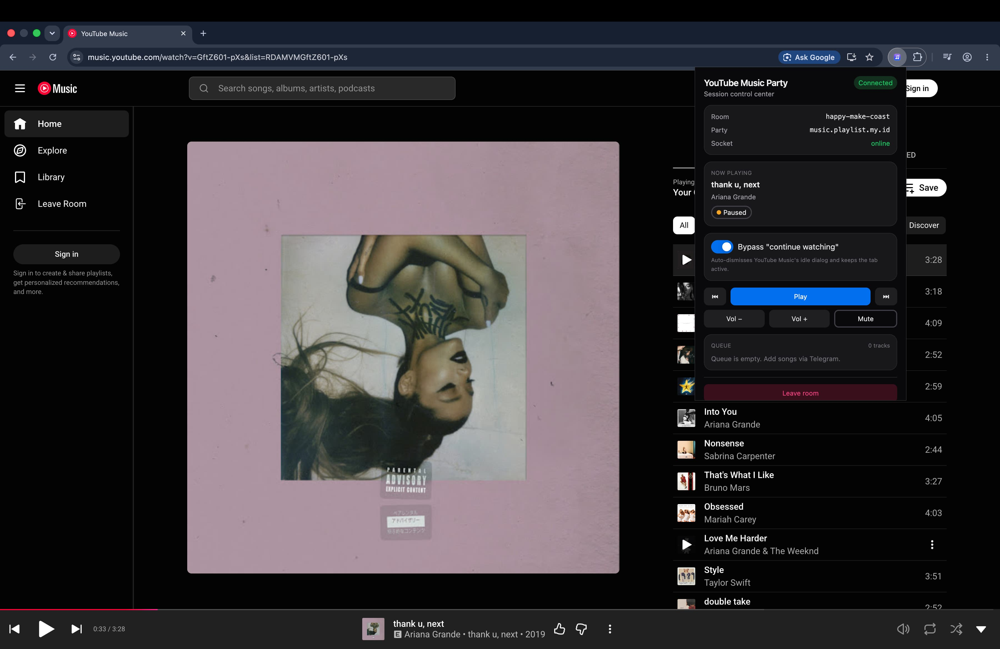
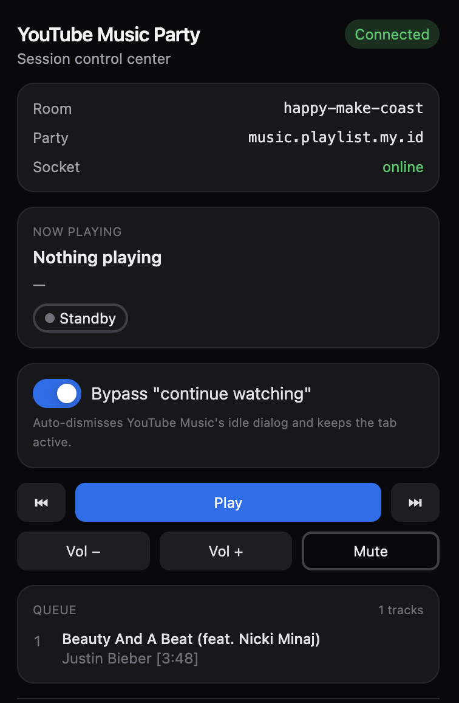
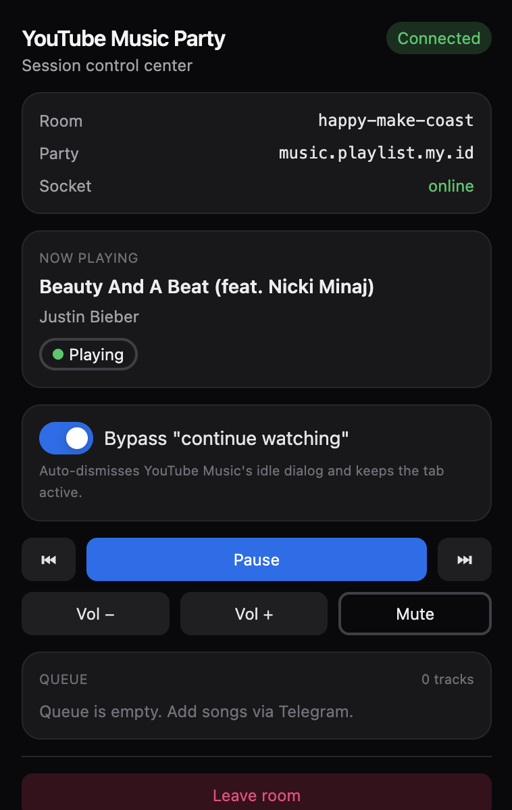
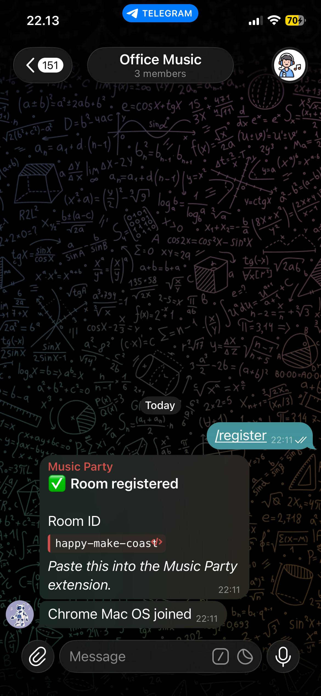
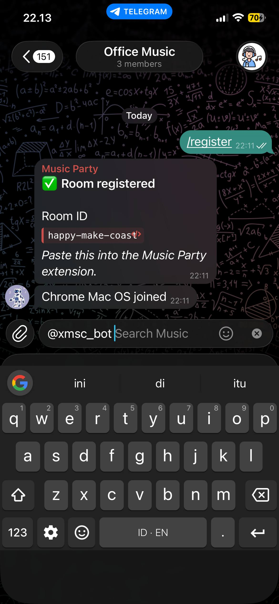
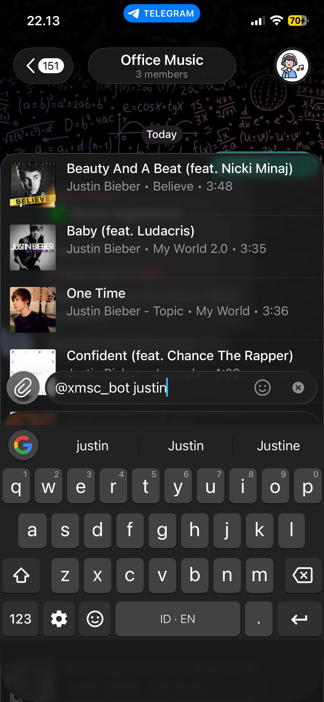
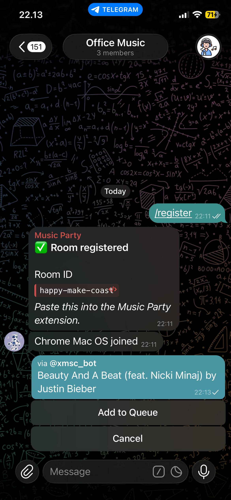
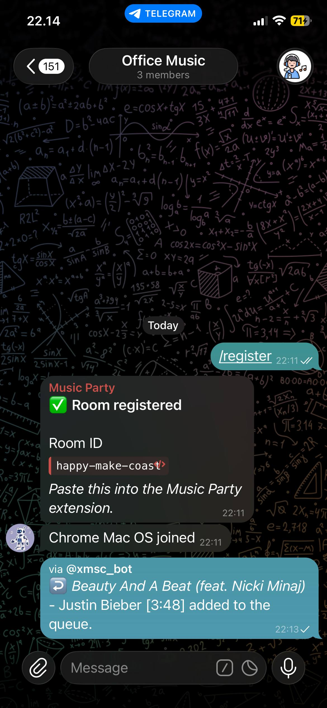

<div align="center">
  <h1>Telegram Music Party</h1>
  <p>Control YouTube Music from Telegram.</p>
</div>

Telegram Music Party connects a Telegram group to a YouTube Music tab. The bot manages rooms, queues, votes, and commands. The browser extension joins the room on `music.youtube.com` and drives playback over Socket.IO.

<p align="center">
  
</p>

## Install

Download the latest extension zip from [GitHub Releases](https://github.com/faytranevozter/telegram-music-party/releases/latest).

```txt
yt-music-party-extension-vX.Y.Z.zip
```

Load it in your browser:

```txt
Chrome  -> chrome://extensions -> Developer mode -> Load unpacked
Firefox -> about:debugging -> This Firefox -> Load Temporary Add-on
```

Use the extracted extension folder, or build locally and load `apps/extension/dist`.

## Quickstart

Add the bot to a Telegram group.

```txt
@xmsc_bot
```

Register the group.

```txt
/register
```

Open YouTube Music and join the room.

```txt
music.youtube.com -> Join Room -> paste Room ID -> enter party server URL
```

Queue a song from Telegram.

```txt
@xmsc_bot never gonna give you up
```

Start playback.

```txt
/play
```

Only one device can be active in a room. Joining from another browser replaces the previous device.

## Screenshots

<p align="center">
  
</p>

<p align="center">
  
  
</p>

<p align="center">
  
  
  
  
  
</p>

## Features

- Telegram-first YouTube Music control
- Inline search and queue management
- Play, pause, next, previous, volume, mute, and lyrics commands
- Vote-to-skip with `/vote_next`
- Admin room configuration with `/config`
- Extension popup for status, now playing, queue, controls, leave, and update checks
- One active player device per room

## Commands

| Command | Description |
|---------|-------------|
| `/start` | Show instructions |
| `/register` | Link the chat or topic to a room |
| `/unregister` | Unlink the room |
| `/play` | Play or resume |
| `/pause` | Pause |
| `/next` | Next track |
| `/prev` | Previous track |
| `/vote_next` | Vote to skip |
| `/queue` | Show queue |
| `/lyrics` | Show lyrics for the current track |
| `/volume_up` | Increase volume |
| `/volume_down` | Decrease volume |
| `/mute` | Mute |
| `/unmute` | Unmute |
| `/info` | Show room info |
| `/devices` | Show connected devices |
| `/config` | View and edit room settings |

## Develop

Requirements:

- Node 22+
- pnpm 10.6+
- PostgreSQL
- Redis

Install dependencies.

```bash
pnpm install
```

Configure the backend.

```bash
cp apps/backend/.env.example apps/backend/.env
pnpm --filter=backend prisma generate
pnpm --filter=backend prisma migrate dev
```

Run everything.

```bash
pnpm dev
```

Build the extension.

```bash
pnpm --filter=extension build
```

Load `apps/extension/dist` as an unpacked extension.

## Scripts

```bash
pnpm --filter=backend dev
pnpm --filter=backend test
pnpm --filter=backend lint
pnpm --filter=backend build

pnpm --filter=extension dev
pnpm --filter=extension test
pnpm --filter=extension lint
pnpm --filter=extension build
```

## Structure

```txt
apps/backend     NestJS, Telegraf, Socket.IO, Prisma, PostgreSQL, Redis
apps/extension   React, Vite, Tailwind, HeroUI, MV3 content scripts
packages         Shared packages placeholder
```

## Release

Version is stored in `VERSION` and mirrored into package manifests and the extension manifest.

```bash
pnpm version:patch
pnpm version:minor
pnpm version:major
```

Publish a release tag.

```bash
git checkout main && git pull
git tag "v$(tr -d '[:space:]' < VERSION)"
git push origin "v$(tr -d '[:space:]' < VERSION)"
```

Release assets:

```txt
ghcr.io/faytranevozter/telegram-music-party:vX.Y.Z
ghcr.io/faytranevozter/telegram-music-party:latest
yt-music-party-extension-vX.Y.Z.zip
```

## Privacy

[Privacy Policy](./PRIVACY.md) for the browser extension.

## License

[MIT](./LICENSE.md)